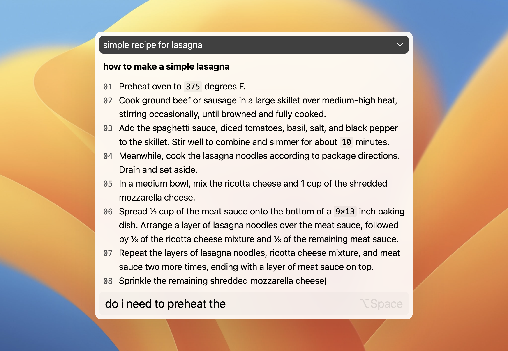

# IntelliBar

### ChatGPT at your fingertips

⇧⌘Space and chat — no logins, no captchas, no tab switching.

## Features

- Keyboard-first design
    - Open Intellibar — ⇧⌘Space
    - New Chat — ⌘N
    - Search Chats — ⌘O
    - Go Back — ⌘[
    - Go Forward — ⌘]
- Prompt Completion
- Tone Control

## A tool you can trust

IntelliBar is just a UI for the ChatGPT API. Your questions go to the ChatGPT API and no one else. The only requests IntelliBar sends to our servers are to check for updates.

## From the team behind Nota

IntelliBar is made by [@erusev](https://github.com/erusev) and [@astoilkov](https://github.com/astoilkov). We've been making tools for thought for over 8 years now, with most of our effort going into our note-taking app, [Nota](https://nota.md/).
